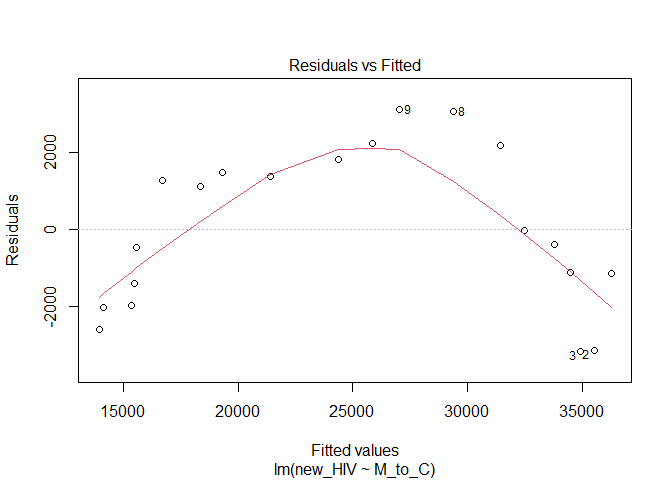
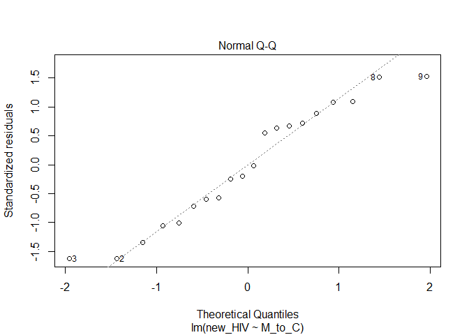
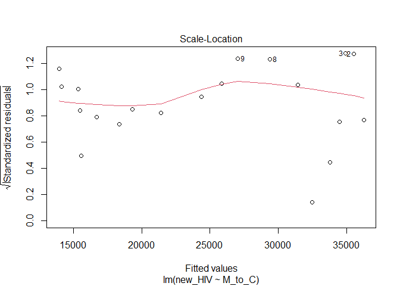
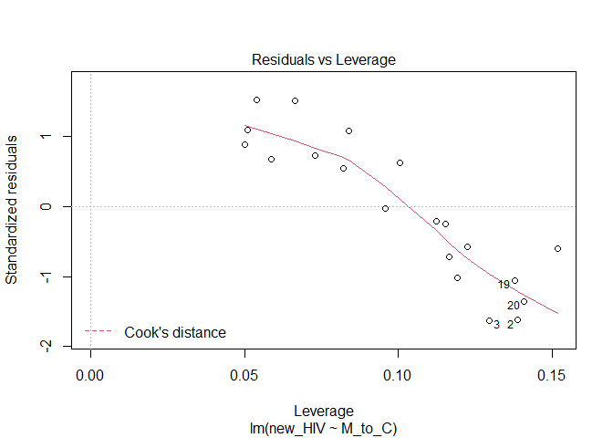
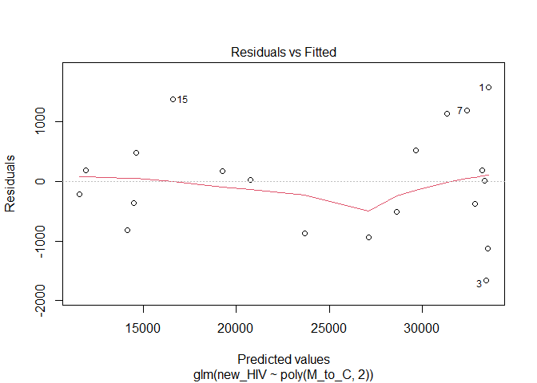
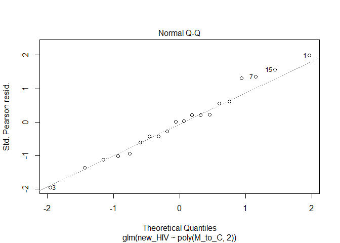
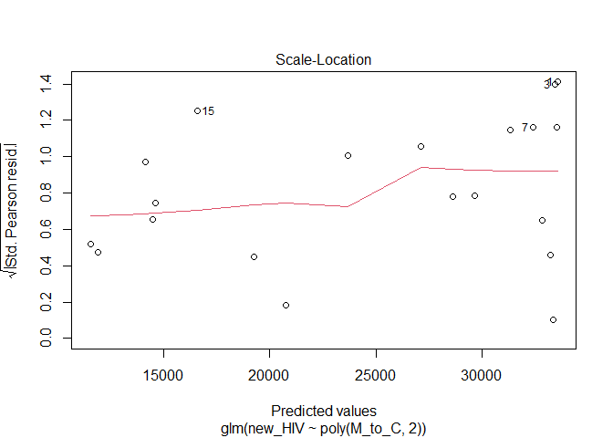
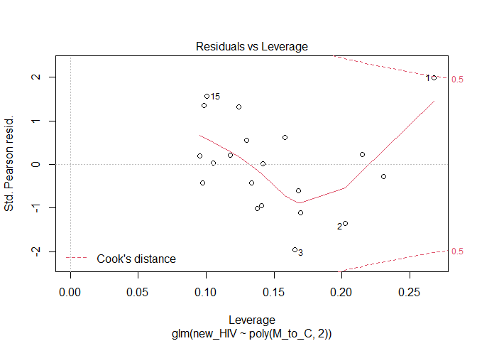
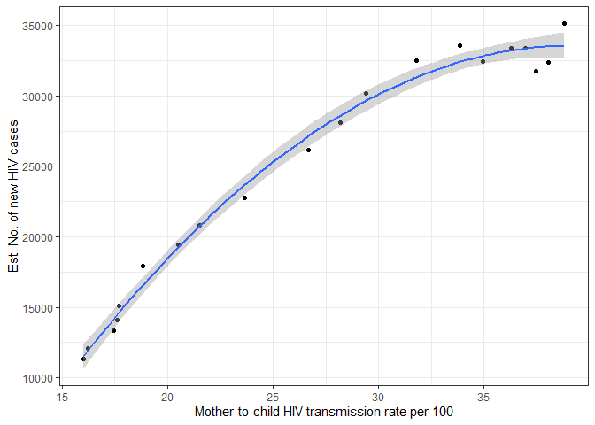
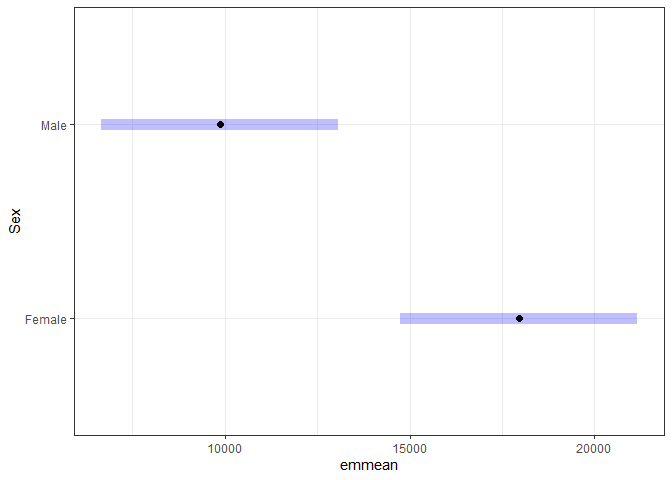

Modelling trends in New HIV Cases and the Mother to Child transmission rate in Easter Africa using GLMs
-------------------------------------------------------------------------------------------------------

Last day we that new HIV infections can be correlated to the increase in
mother-baby transmission i.e. as the mother to child transmission rate
increases the number of new HIV cases in young adults also increases. We
ran a standard linear regression using the lm() function and although it
seemed like a good fit based on the pearson correlation coefficient, the
diagnostic plots suggested otherwise. For one the Residual vs Fitted
plot clearly indicated that the data was not fitting a line. This week I
am going back to that same data and using the glm() function testing to
see if there are other models that would fit the data better and create
cleaner diagnostic plots. To broaden the analysis I have decided to
increase the scope of the data from 2005-2019 to 2000-2019.

``` r
#Packages Used ----
library(ggplot2)
library(emmeans)
```

This data has been downloaded from
<a href="https://data.unicef.org/dv_index/" class="uri">https://data.unicef.org/dv_index/</a>

``` r
Plot_ready <- read.csv('Cor_data.csv')
Plot_ready_S <- read.csv('Cor_data_Sew.csv')
```

I have not shown the data handling again this week, the final tables
from last week have been imported for the purposes of his exercise.

### Initial Diagnostics

``` r
m1 <- lm(new_HIV~ M_to_C, data=Plot_ready)
#Plot
p2 <- plot(m1, id.n=4)
```



``` r
m3 <- shapiro.test(Plot_ready$new_HIV) # W = 0.87212, p-value = 0.01281
m4 <- shapiro.test(Plot_ready$M_to_C)  # W = 0.88695, p-value = 0.02364
```

### Final Diagnostics

The biggest issue with the Initial Diagnostic seen above is the residual
vs fitted plot clearly suggests a non-linear fit. The sharpiro test on
the 2000-2019 data suggests a normal distribution and since the
scale-location plot suggests a consistent degree of variance, I think
the best approach for a GLM is a Gaussian distribution with a polynomial
fit.

As seen from the second run at diagnostics, the first residuals vs
fitted has significantly flattened, and we can now move to the actual
plot of the model.

``` r
#Diagnostic Test ----
m1 <- glm(new_HIV~poly(M_to_C, 2),Plot_ready,family=gaussian(link = "identity"))

#Plot
m2 <- plot(m1, id.n=4)
```



### Final Model

``` r
plot <- ggplot(Plot_ready, aes(M_to_C, new_HIV)) + 
  geom_point() + 
  geom_smooth(method='glm', formula = y~poly(x,2)) + 
  xlab("Mother-to-child HIV transmission rate per 100") + 
  ylab("Est. No. of new HIV cases") + theme_bw(); plot
```



### Comapring Males to Females using emmeans

To study whether there is a difference in the correlation above w.r.t.
Sex, I used the emmeans package and took into account sex based
difference in the data. The lack of overlap with the confidence
intervals around the two means alone indicate a significant different
between the two groups, but unlike the linear regression from last week
the confidence intervals are a lot larger than last week.

``` r
#emmeans pairwise comparison on the bases of sex ----

lmboth <- glm(new_HIV~poly(M_to_C, 2) + Sex , Plot_ready_S, family=gaussian(link = "identity"))
e1 <- emmeans(lmboth, "Sex")
p <- plot(e1) + theme_bw(); p
```


