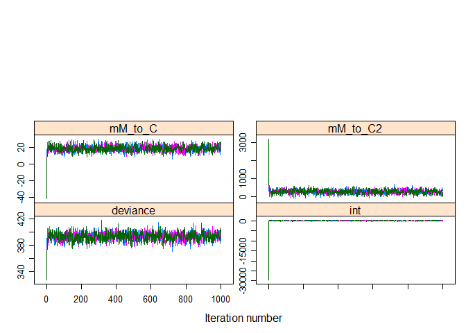

For this assignment I have tried to re-create the \#glm() assignment
from two weeks ago using bayesien tools. I did not include the Male vs
Female differences, because I was not able to find a way to combine
continuous and discrete variables that did not break everything.

``` r
#Packages Used ----
library(dplyr)
library(R2jags)
library(emdbook)
library(dotwhisker)
library(emmeans)
```

I removed unnecessary columns from the data because the model was
complaining a lot when I left them as is. I have re-analyzed the data
using the frequentest approach below.

``` r
# Data and Frequentest model results ----
Plot_ready <- read.csv('Cor_data.csv')

Plot_ready <- Plot_ready %>% 
  select(-X, -TIME_PERIOD)
  

summary(glm(new_HIV~poly(M_to_C, 2),Plot_ready,family=gaussian(link = "identity")))
```

    ## 
    ## Call:
    ## glm(formula = new_HIV ~ poly(M_to_C, 2), family = gaussian(link = "identity"), 
    ##     data = Plot_ready)
    ## 
    ## Deviance Residuals: 
    ##      Min        1Q    Median        3Q       Max  
    ## -1660.13   -588.84     19.32    490.21   1582.97  
    ## 
    ## Coefficients:
    ##                  Estimate Std. Error t value Pr(>|t|)    
    ## (Intercept)       24796.8      207.7 119.369  < 2e-16 ***
    ## poly(M_to_C, 2)1  35996.8      929.0  38.748  < 2e-16 ***
    ## poly(M_to_C, 2)2  -8007.1      929.0  -8.619  1.3e-07 ***
    ## ---
    ## Signif. codes:  0 '***' 0.001 '**' 0.01 '*' 0.05 '.' 0.1 ' ' 1
    ## 
    ## (Dispersion parameter for gaussian family taken to be 863055.1)
    ## 
    ##     Null deviance: 1374557363  on 19  degrees of freedom
    ## Residual deviance:   14671937  on 17  degrees of freedom
    ## AIC: 334.87
    ## 
    ## Number of Fisher Scoring iterations: 2

To create the model on the .bug file I regenerated the polynomial
prediction. Since the rate of transmission from mother to child is per
100, I chose 50 as the mean and left the precision wide open. I was not
too sure what would be more appropriate. I was unclear and sort of still
am on whether the numbers within \#dnorm() are the values of that
parameter or the values w.r.t. to the response variable. I tried several
different numbers large and small and the RHat and n.eff did not change
much, so I was not sure how one evaluates the quality of one model over
the other. In the end i just stuck to my original assumptions as stated
below.

I kept the distributions as normal primarily because that was what I
assumed when I created the GLM about this dataset. I did try different
distribution, but several of them particularly the uniform and logistic
for some other types of data made the model complain a lot. I was not
too clear how to interpret the errors for non-continuous data.

I ran the model with JAGS and plotted the \#dotwhisker plot. Clearly the
numbers don’t match up well to the frequentest numbers from the start of
this exercise. Perhaps my assumptions were too small? For a polynomial
model like this one, I do wonder how one goes about plotting this the
way the \#geom\_smooth() plots it to the dataset.

I am tempted to go back and change the priors, but I think that defeats
the purpose of them being priors. If that is the case, I wonder what one
is meant to do at this point. How can I improve upon this to make it
more meaningful to my dataset. In this particular example I did not
include other predictor variable, I suspect the number may be more fluid
if there was more of those as well.

``` r
# R2jags model setup ----
set.seed(1234)
N <- 20
jags1 <- jags(model.file='ass8.bug',
              parameters=c("mM_to_C", "mM_to_C2", "int"),
              data = list(M_to_C = Plot_ready$M_to_C, new_HIV = Plot_ready$new_HIV, N = N),
              n.chains = 3,
              inits=NULL); jags1
```

    ## Compiling model graph
    ##    Resolving undeclared variables
    ##    Allocating nodes
    ## Graph information:
    ##    Observed stochastic nodes: 20
    ##    Unobserved stochastic nodes: 4
    ##    Total graph size: 130
    ## 
    ## Initializing model

    ## Inference for Bugs model at "ass8.bug", fit using jags,
    ##  3 chains, each with 2000 iterations (first 1000 discarded)
    ##  n.sims = 3000 iterations saved
    ##          mu.vect sd.vect     2.5%     25%     50%     75%   97.5%  Rhat n.eff
    ## int        6.257 937.521 -161.092 -34.779  36.012 103.366 232.671 1.001  3000
    ## mM_to_C   18.697   4.062   11.970  16.344  18.605  21.164  26.010 1.001  3000
    ## mM_to_C2 298.190 146.689   70.284 217.968 295.874 371.561 517.797 1.001  3000
    ## deviance 392.846   6.515  380.390 388.941 393.092 397.170 404.233 1.001  3000
    ## 
    ## For each parameter, n.eff is a crude measure of effective sample size,
    ## and Rhat is the potential scale reduction factor (at convergence, Rhat=1).
    ## 
    ## DIC info (using the rule, pD = var(deviance)/2)
    ## pD = 21.2 and DIC = 414.1
    ## DIC is an estimate of expected predictive error (lower deviance is better).

``` r
mm <- as.mcmc.bugs(jags1$BUGSoutput); plot(mm)
```



``` r
print(dwplot(jags1)) 
```


